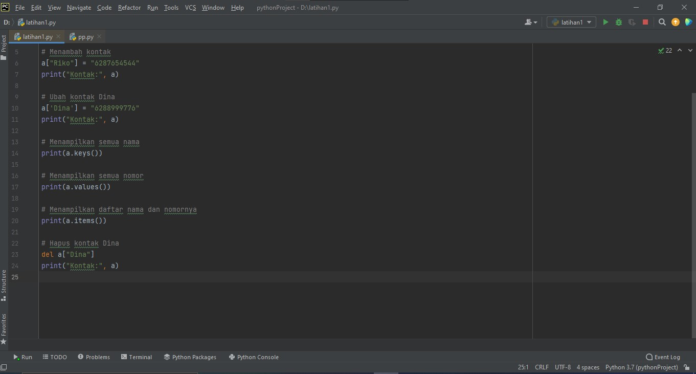
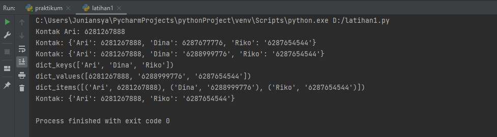
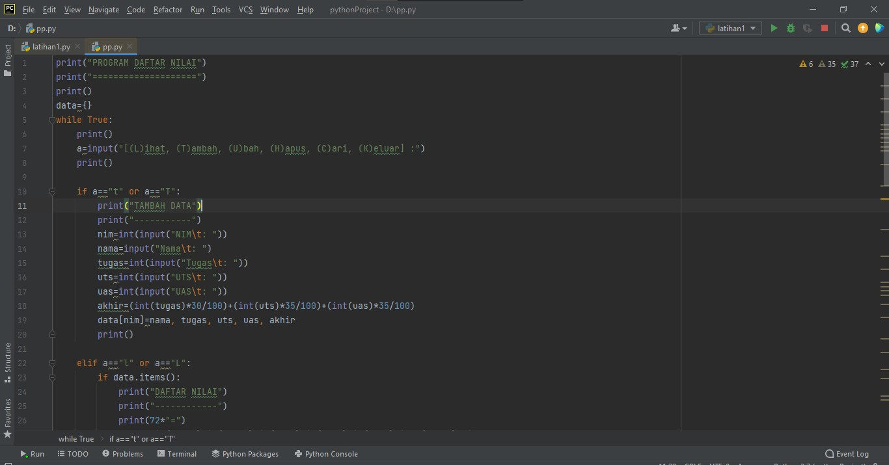
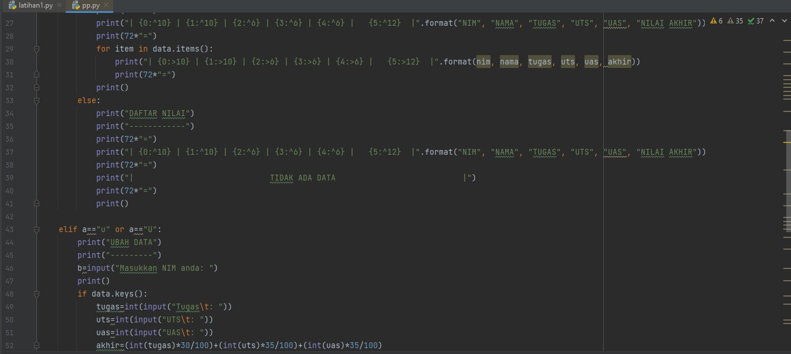
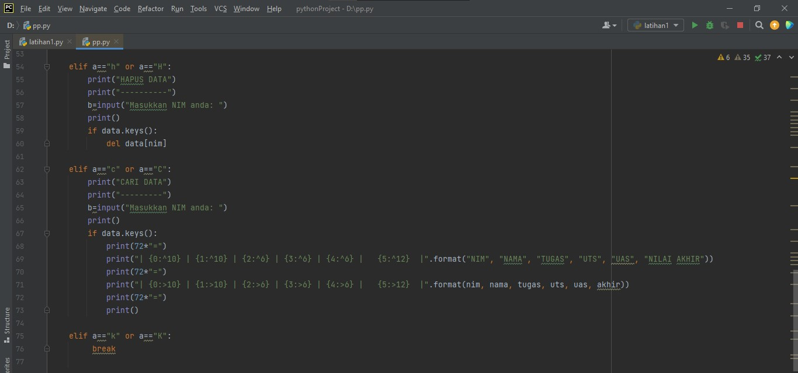
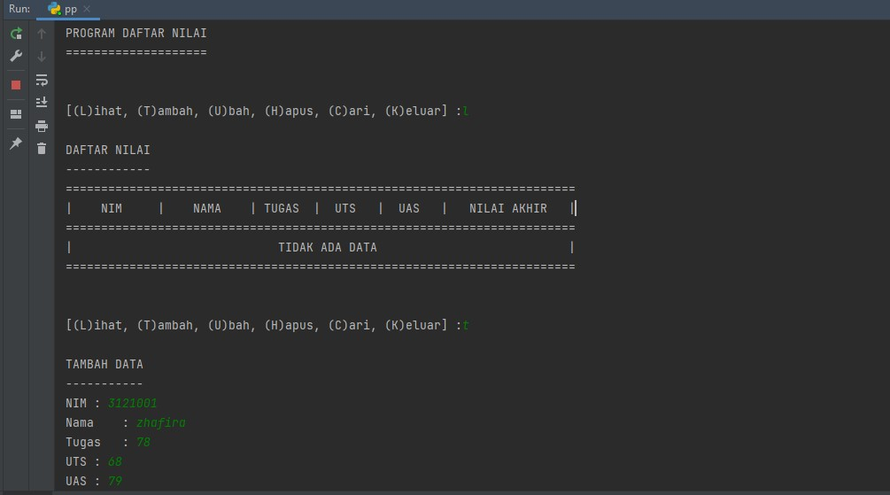
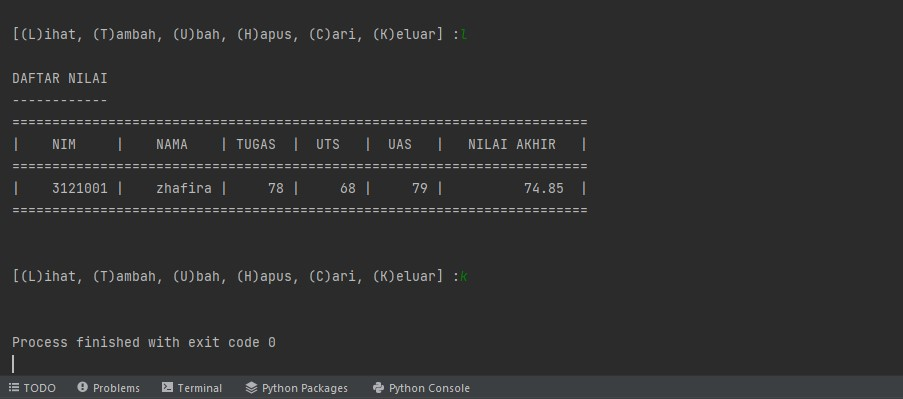

# PERTEMUAN 10
 
### Latihan 1
A. Program



#### Output




### B. Penjelasan
 
1. Menampilkan kontak Ari.
```python
	print("kontak Ari :", s['Ari'])
```
2. Jika ingin menambahkan kontak baru gunakan 
	```python
	s['Riko']='087654544';
	```
3. Untuk mengubah kontak yang lama dengan yang baru yg semula `'Dina': '087677776'` menjadi `'Dina': '088988776'`.

	```python
	s['Dina']='088988776';
    ```
4. Untuk menampilkan semua nama kontak, gunakan `keys()`.
	```python
	print(s.keys())
	```
5. Jika ingin menampilkan semua nomor kontak, gunakan `values()`.
	```pyhton
	print(s.values())
	```
6. Untuk menampilkan daftar kontak beserta nomor teleponnya, gunakan `items()`.
	```pyhton
	print(s.items())
	```
7. Untuk menghapus salah satu kontak
	```python
	del s['Dina'];
	```
###  Pratikum 5


### B. Program







### C. Penjelasan

1. Membuat dictionary kosong yang nantinya akan diinput dengan data.
	```python
	data={}
	```

2. Membuat perulangan dengan _while_ dan terdapat pilihan menu untuk menjalankan program.
	```python
	while True:
    print()
    a=input("[(L)ihat, (T)ambah, (U)bah, (H)apus, (C)ari, (K)eluar] :")
    print()
	```
3. Menambahkan data nim, nama, nilai tugas, uts, dan uas. Data yang diinputkan akan masuk ke dalam dictionary **data** dengan **nim** sebagai keys sedangkan nama, tugas, uts dan uas sebagai **values**.
	```python
	if a=="t" or a=="T":
        print("TAMBAH DATA")
        print("-----------")
        nim=int(input("NIM\t: "))
        nama=input("Nama\t: ")
        tugas=int(input("Tugas\t: ")) 
        uts=int(input("UTS\t: "))
        uas=int(input("UAS\t: "))
        akhir=(int(tugas)*30/100)+(int(uts)*35/100)+(int(uas)*35/100)
        data[nim]=nama, tugas, uts, uas, akhir
	```
4. Menampilkan atau melihat data. Jika sebelumnya belum menginput data, maka tampilannya akan "Tidak ada data". Apabila sudah menginput data, maka data yang telah diinput tadi akan ditampilkan.
	```python
	elif a=="l" or a=="L":
        if data.items():
            print("DAFTAR NILAI")
            print("------------")
            print(72*"=")
            print("| {0:^10} | {1:^10} | {2:^6} | {3:^6} | {4:^6} |   {5:^12}  |".format("NIM", "NAMA", "TUGAS", "UTS", "UAS", "NILAI AKHIR"))
            print(72*"=")
            for item in data.items(): 
                print("| {0:>10} | {1:>10} | {2:>6} | {3:>6} | {4:>6} |   {5:>12}  |".format(nim, nama, tugas, uts, uas, akhir))
                print(72*"=")
            print()
        else:
            print("DAFTAR NILAI")
            print("------------")
            print(72*"=")
            print("| {0:^10} | {1:^10} | {2:^6} | {3:^6} | {4:^6} |   {5:^12}  |".format("NIM", "NAMA", "TUGAS", "UTS", "UAS", "NILAI AKHIR"))
            print(72*"=")
            print("|                             TIDAK ADA DATA                           |")
            print(72*"=")
            print()
	```

5. Jika data sudah selesai diinput, pilih menu **'k'/'K'** maka program akan terhenti.
	```python
	elif a=="k" or a=="K":
         break
	```

### D. Output






### Terimakasih